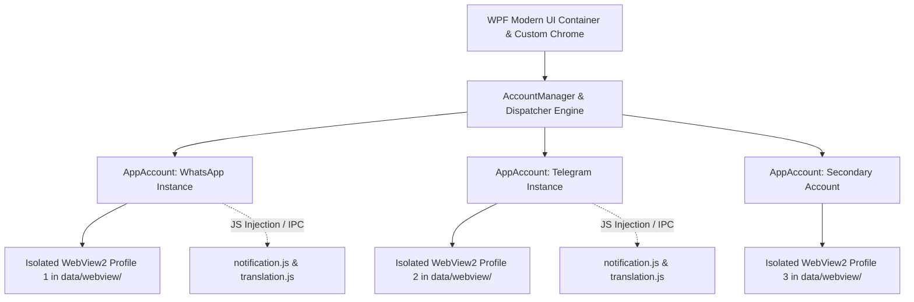

# Dietro le Quinte di HidaChat: Architettura di un Client Desktop Multi-Account Portabile per WhatsApp e Telegram in .NET 9


I moderni strumenti di messaggistica istantanea come **WhatsApp** e **Telegram** sono diventati indispensabili per il lavoro e la vita privata. Tuttavia, chiunque debba gestire contemporaneamente account personali, aziendali o multi-piattaforma su Windows si scontra presto con limiti architetturali evidenti:

1. **Client ufficiali rigidi**: le app desktop ufficiali non consentono agevolmente l'uso simultaneo di più account con profili separati nella stessa interfaccia.
2. **La pesantezza di Electron**: la maggior parte dei wrapper alternativi si basa su Electron, istanziando per ogni finestra un intero runtime Node.js + Chromium, con consumi di RAM che superano facilmente i 500MB–1GB.
3. **Mancanza di reale portabilità**: le sessioni vengono salvate in cartelle di sistema (`%AppData%`, registro di Windows) rendendo impossibile spostare la propria configurazione su una chiavetta USB.
4. **Assenza di strumenti di traduzione al volo**: messaggi in lingue straniere richiedono il continuo copia-incolla su servizi esterni.

Per risolvere queste sfide è nato **HidaChat**, un client desktop open-source scritto in **.NET 9 / WPF** e basato sul runtime nativo **Microsoft Edge WebView2**.

In questo articolo analizziamo le scelte tecniche, l'architettura dei thread, la gestione delle sandbox di isolamento e le soluzioni adottate per garantire prestazioni a 0ms di lag e il 100% di portabilità.

---

## 🎬 Dimostrazione dal Vivo

Ecco come si presenta l'interfaccia con cambio scheda istantaneo e traduzione live dei messaggi:

<p align="center">
  
</p>

---

## 🏗️ Architettura del Sistema

L'architettura di HidaChat si articola in quattro layer fondamentali:



### 1. Perché .NET 9 + WebView2 invece di Electron?

La decisione di abbandonare lo stack Node.js/Electron in favore di **.NET 9 + WebView2** offre vantaggi misurabili:

| Metrica | Wrapper Electron Tradizionali | HidaChat (.NET 9 + WebView2) | Vantaggio |
| :--- | :---: | :---: | :---: |
| **Dimensione Pacchetto Eseguibile** | ~120 MB - 180 MB | **~8 MB** (ZIP portabile) | **-95%** di spazio su disco |
| **Consumo RAM a Riposo (2 Account)** | 550 MB - 900 MB | **140 MB - 220 MB** | **-70%** di memoria RAM |
| **Runtime di Sistema** | Include duplicato Chromium + Node | Sfrutta Edge WebView2 integrato in Windows | Zero duplicazione runtime |
| **Avvio a Freddo** | 3.5s - 6.0s | **< 1.2s** | Risposta istantanea |

---

## ⚡ Soluzioni Tecniche e Sfide di Ingegnerizzazione

### 1. Pre-caricamento Intelligente e Passaggio Scheda a 0ms (`Visibility.Hidden`)

Nei client multi-scheda standard, quando si passa da un account all'altro, il controllo web sottostante viene spesso distrutto o navigato nuovamente, causando ricaricamenti da zero, perdita dei messaggi in bozza e disconnessioni WebSocket.

In HidaChat:
- All'avvio dell'applicazione (`PopulateWebViews()`), l'account attualmente selezionato viene istanziato e renderizzato con priorità assoluta per consentire l'accesso immediato all'utente.
- Contestualmente, gli altri account configurati vengono pre-caricati in background all'interno della griglia WPF impostando `Visibility = Visibility.Hidden` invece di `Collapsed`.
- In questo modo il runtime Chromium mantiene le sessioni "calde", i WebSocket sempre attivi e i layout già renderizzati in memoria: il passaggio tra WhatsApp e Telegram avviene in **tempo reale (0 millisecondi di delay)**.

```vb
' MainWindow.xaml.vb (Estratto logica pre-caricamento ordinato)
Private Async Sub PopulateWebViews()
    WebViewsGrid.Children.Clear()

    ' 1. Priorità all'account attivo
    Dim activeAccount = _accountManager.CurrentAccount
    If activeAccount IsNot Nothing Then
        Await EnsureWebViewAsync(activeAccount)
        activeAccount.WebView.Visibility = Visibility.Visible
    End If

    ' 2. Pre-riscaldamento in background degli altri account
    Dim otherAccounts = _accountManager.Accounts.Where(Function(a) a IsNot activeAccount).ToList()
    For Each acc In otherAccounts
        Await EnsureWebViewAsync(acc)
        acc.WebView.Visibility = Visibility.Hidden
    Next
End Sub
```

---

### 2. Prevenzione del Throttling dei Timer e Notifiche in Background

Chromium per impostazione predefinita disattiva o rallenta l'esecuzione dei timer JavaScript e i socket di rete nelle schede e finestre nascoste o occluse. Questo causava la perdita di notifiche quando si chattava su una scheda diversa o con l'app ridotta a icona.

Per garantire la ricezione in tempo reale dei messaggi su tutte le piattaforme, abbiamo configurato argomenti mirati di avvio in `AppAccounts.vb`:

```vb
Dim options As New CoreWebView2EnvironmentOptions()
options.AdditionalBrowserArguments = "--disk-cache-size=104857600 --media-cache-size=52428800 " &
    "--disable-background-timer-throttling " &
    "--disable-backgrounding-occluded-windows " &
    "--disable-renderer-backgrounding " &
    "--disable-features=Translate,OptimizationHints,MediaRouter"
```

Grazie a questi parametri e agli script iniettati su `AddScriptToExecuteOnDocumentCreatedAsync`:
- L'API standard `window.Notification` e `ServiceWorkerRegistration.showNotification` vengono intercettate prima ancora che la pagina web le esegua.
- I messaggi in arrivo vengono instradati tramite IPC protetto (`window.chrome.webview.postMessage`) verso l'host WPF nativo, che genera sia la notifica Toast nativa di Windows sia il **MessagePopup** con badge differenziato per piattaforma.

---

### 3. Integrazione Win32: Risoluzione del Maximize su Finestre Senza Bordi (`WM_GETMINMAXINFO`)

Le moderne applicazioni WPF con barre del titolo personalizzate (`WindowStyle="None"`, `AllowsTransparency="True"`) soffrono di un noto bug dell'API di Windows: quando vengono ingrandite a schermo intero (`WindowState = Maximized`), coprono completamente la barra delle applicazioni (Taskbar).

Abbiamo risolto il problema agganciando la procedura di finestra (`HwndSourceHook`) per intercettare il messaggio Win32 `WM_GETMINMAXINFO` e limitare l'ingrandimento all'Area di Lavoro effettiva del monitor (`rcWork`):

```vb
' MainWindow.xaml.vb (Hook Win32)
Private Function HwndSourceHook(hwnd As IntPtr, msg As Integer, wParam As IntPtr, lParam As IntPtr, ByRef handled As Boolean) As IntPtr
    If msg = WM_GETMINMAXINFO Then
        Dim mmi As MINMAXINFO = Marshal.PtrToStructure(Of MINMAXINFO)(lParam)
        Dim monitor As IntPtr = MonitorFromWindow(hwnd, MONITOR_DEFAULTTONEAREST)
        If monitor <> IntPtr.Zero Then
            Dim monitorInfo As New MONITORINFO()
            monitorInfo.cbSize = Marshal.SizeOf(monitorInfo)
            If GetMonitorInfo(monitor, monitorInfo) Then
                mmi.ptMaxPosition.X = Math.Abs(monitorInfo.rcWork.Left - monitorInfo.rcMonitor.Left)
                mmi.ptMaxPosition.Y = Math.Abs(monitorInfo.rcWork.Top - monitorInfo.rcMonitor.Top)
                mmi.ptMaxSize.X = Math.Abs(monitorInfo.rcWork.Right - monitorInfo.rcWork.Left)
                mmi.ptMaxSize.Y = Math.Abs(monitorInfo.rcWork.Bottom - monitorInfo.rcWork.Top)
                Marshal.StructureToPtr(mmi, lParam, True)
                handled = True
            End If
        End If
    End If
    Return IntPtr.Zero
End Function
```

---

### 4. Motore di Traduzione Messaggi Multi-Piattaforma (`translation.js`)

Invece di affidarsi a traduttori lenti o a pagamento, HidaChat inietta un observer JavaScript altamente ottimizzato che individua sia le bolle di **WhatsApp Web** (`.selectable-text`, `[data-testid="msg-container"]`) sia quelle di **Telegram Web K** (`.bubble`, `.message`, `.text-content`).

- **Al passaggio del mouse**: mostra un pulsante leggero e discreto che traduce il singolo messaggio al click.
- **Traduzione batch**: consente con un click di tradurre l'intera cronologia della conversazione visibile a schermo.
- **Cache persistente**: i segmenti già tradotti vengono memorizzati in `data/translations_cache.json` per evitare chiamate ridondanti.

---

## 📸 Galleria dell'Interfaccia

| Interfaccia Multi-Account (Dark Mode) | Traduzione Istantanea al Volo |
| :---: | :---: |
|  |  |
| **Notifiche Toast Native con Click Routing** | **Temi Chiaro e Scuro Automatici** |
|  |  |

---

## 📦 Installazione e Distribuzione

HidaChat supporta la distribuzione tramite il gestore ufficiale di Microsoft e in formato portatile autonomo:

### 1. Installazione via Windows Package Manager (`winget`)
```powershell
winget install hidaba.HidaChat
```

### 2. Pacchetto Portatile ZIP (Zero Installazione)
1. Scarica l'archivio ZIP pre-compilato da **[GitHub Releases](https://github.com/hidaba/HidaChat/releases/latest)**.
2. Estrai la cartella in qualsiasi percorso locale o su una chiavetta USB.
3. Avvia `HidaChat.exe`. Tutti i dati, cookie e impostazioni rimangono confinati nella cartella `data/`.

---

## 🔗 Link Utili & Risorse Open Source

- 💻 **Repository GitHub Ufficiale**: [github.com/hidaba/HidaChat](https://github.com/hidaba/HidaChat)
- 📦 **Ultima Release Compilata**: [Download HidaChat v0.5.1](https://github.com/hidaba/HidaChat/releases/latest)
- 📜 **Changelog Completo**: [CHANGELOG.md](https://github.com/hidaba/HidaChat/blob/master/CHANGELOG.md)
- 🤝 **Licenza**: Open Source sotto licenza [Apache 2.0](https://github.com/hidaba/HidaChat/blob/master/LICENSE.txt)
