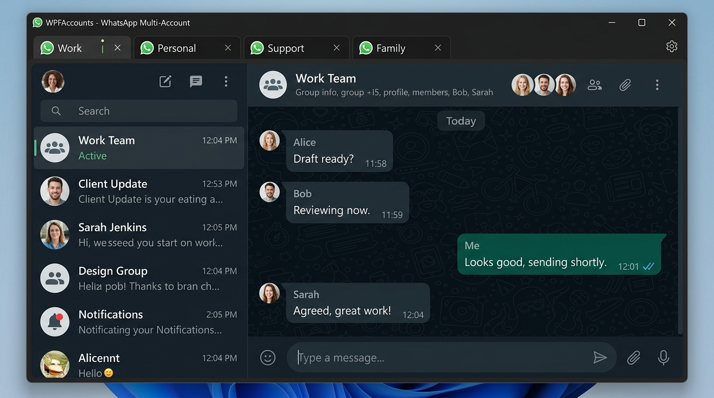
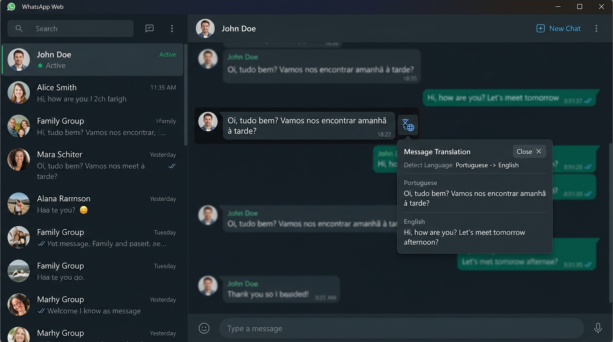
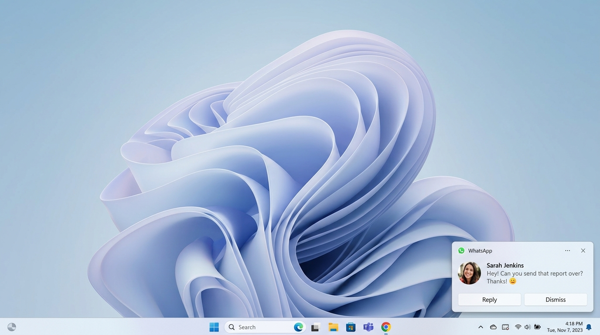
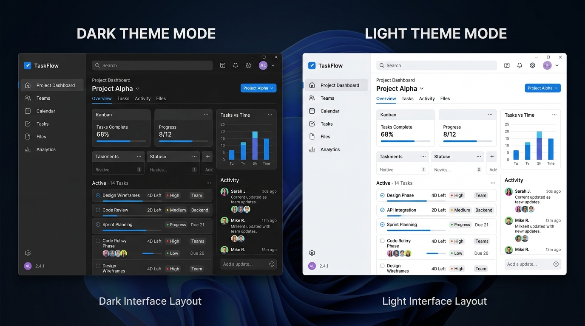

# WhatsAppH

[](README.it.md)
[](README.md)

**Client Desktop Portabile per Windows (.NET 9 / WPF) per WhatsApp Web** con supporto **Multi-Account**, **Traduzione Integrata dei Messaggi**, **Notifiche Native Windows** e **Zero Installazione**.

[](LICENSE.txt)
[](https://dotnet.microsoft.com/)
[](https://github.com/hidaba/WhatsAppH/releases/latest)
[](https://github.com/hidaba/WhatsAppH/releases)
[](https://github.com/hidaba/WhatsAppH/commits/master)
[](https://github.com/hidaba/WhatsAppH/actions)

---

## 📸 Anteprima & Screenshot

| **Interfaccia Multi-Account (Tema Scuro)** | **Traduzione Istantanea Messaggio** |
|:---:|:---:|
|  |  |
| **Notifiche Native Windows Toast** | **Temi Chiaro e Scuro** |
|  |  |

---

## 📦 Download Eseguibile per Windows

Scarica l'ultima versione portatile pronta all'uso per Windows (archivio ZIP, nessun bisogno di installazione):

- ⬇️ **[Scarica l'ultima versione compilata (GitHub Releases)](https://github.com/hidaba/WhatsAppH/releases/latest)**
- 📂 Estrai l'archivio ZIP in qualsiasi cartella (locale o chiavetta USB) ed avvia `WhatsappH.exe`.

> ⚠️ **Nota Importante sulla Portabilità**: Non eseguire WhatsAppH contemporaneamente da più computer che accedono alla stessa cartella di rete condivisa: potrebbe corrompere le sessioni WebView2 e le impostazioni. WhatsAppH è progettato per essere utilizzato da un solo PC alla volta.

---

## 🌟 Perché WhatsAppH? (Confronto)

| Caratteristica | WhatsAppH | WhatsApp Desktop Ufficiale | Altus (`amanharwara/altus`) | whatRust (`karem505/whatRust`) |
|---|:---:|:---:|:---:|:---:|
| **Installazione Richiesta** | ❌ **Nessuna (Portabile)** | ✅ Richiesta | ✅ Richiesta | ✅ Richiesta |
| **Dati Spostabili (USB/Rete)** | ✅ **Sì (ZIP / USB)** | ❌ No | ❌ No | ❌ No |
| **Supporto Multi-Account** | ✅ **Sì (Tab Separati)** | ❌ No | ✅ Sì | ✅ Sì |
| **Traduttore Messaggi Integrato** | ✅ **Sì (Hover + Pagina)** | ❌ No | ❌ No | ❌ No |
| **Notifiche Native Windows** | ✅ **Sì** | ✅ Sì | ✅ Sì | ✅ Sì |
| **Motore Render** | **WebView2 (Nativo Win)** | Electron | Electron | WebView (Tauri/Rust) |
| **Open Source** | ✅ **Sì (Apache-2.0)** | ❌ No | ✅ Sì | ✅ Sì |

---

## 🚀 Caratteristiche Principali

- 👥 **Gestione Multi-Account**: Utilizza più account WhatsApp Web contemporaneamente in schede dedicate con profili WebView2 isolati.
- 🎨 **Design Moderno e Temi**: Interfaccia scura/chiara con rilevamento automatico del tema di sistema Windows.
- 🌐 **Traduzione Integrata**:
  - **Pulsante Hover**: Traduci singoli messaggi passando il mouse sulla chat.
  - **Traduzione Batch**: Traduci l'intera pagina di conversazione istantaneamente.
  - **Notifiche Tradotte**: Traduzione automatica dei messaggi in arrivo nelle notifiche.
- 🔔 **Notifiche Native Windows Toast**: Instadamento intelligente del click per aprire la scheda e la chat corretta.
- 📌 **System Tray Integration**: Riduzione nell'area di notifica di Windows con contatore messaggi non letti.
- 🚀 **Aggiornamenti OTA**: Check automatico e download degli aggiornamenti via GitHub Releases.

---

## 💻 Requisiti di Sistema

- **OS**: Windows 10 (build 19041 o successiva) / Windows 11
- **Runtime**: [Microsoft Edge WebView2 Runtime](https://developer.microsoft.com/microsoft-edge/webview2/) (incluso di serie in Windows 11)
- **Framework**: .NET 9.0 Runtime

---

## 🛠️ Compilazione da Sorgente

Per compilare ed eseguire il progetto localmente:

```bash
# Clona il repository
git clone https://github.com/hidaba/WhatsAppH.git
cd WhatsAppH

# Ripristina le dipendenze e compila
dotnet restore
dotnet build -c Release
```

In alternativa, puoi aprire la soluzione `WhatsappH.sln` con **Visual Studio 2022** (.NET 9 SDK installato) e premere `F5`.

---

## 📖 Guida Rapida all'Uso

1. **Aggiunta Account**: Avvia `WhatsappH.exe` e rinomina o aggiungi account dal menu delle schede o dalle **Impostazioni** (⚙️).
2. **Accesso WhatsApp**: Inquadra il codice QR con l'app WhatsApp dello smartphone per sincronizzare la sessione.
3. **Traduzione**: Passa il mouse su qualsiasi messaggio per visualizzare l'icona di traduzione istantanea 🌐.

### 🕹️ Controlli della Barra del Titolo

| Icona | Azione |
| :---: | :--- |
| ⚙️ | Apre la finestra Impostazioni (tema, lingua, gestione account) |
| 🔄 | Ricarica la scheda dell'account attivo |
| 🌐 | Traduce l'intera pagina di chat |
| ✕ / — | Minimizza o riduci nella barra delle applicazioni / tray |

---

## 🗺️ Roadmap e Changelog

Consulta il file [CHANGELOG.md](CHANGELOG.md) per lo storico delle versioni e le ultime novità.

---

## 🤝 Contributi e Sicurezza

- **Contribuire**: Leggi le linee guida in [CONTRIBUTING.md](CONTRIBUTING.md) prima di inviare nuove Pull Request.
- **Sicurezza**: Per segnalare vulnerabilità di sicurezza, consulta [SECURITY.md](SECURITY.md).
- **Codice di Condotta**: Il progetto adotta il [Contributor Covenant Code of Conduct](CODE_OF_CONDUCT.md).

---

## 📄 Licenza

Distribuito sotto licenza **Apache 2.0**. Consulta il file [LICENSE.txt](LICENSE.txt) per i dettagli.
