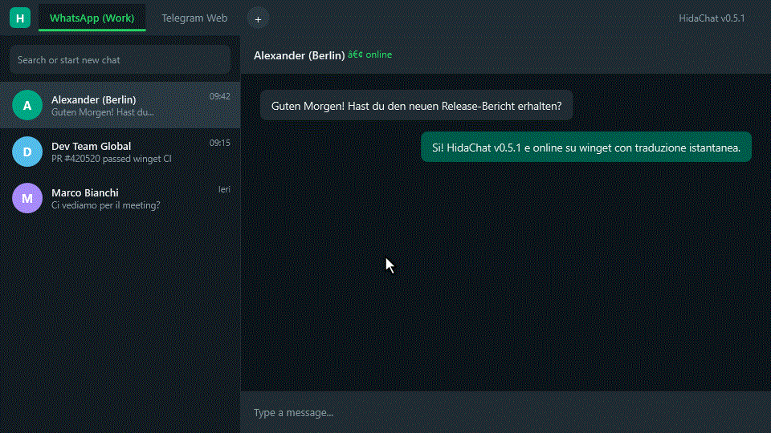

# HidaChat

[](README.it.md)
[](README.md)

**Client Desktop Portabile per Windows (.NET 9 / WPF)** con gestione **Multi-Account e Multi-Piattaforma** (**WhatsApp Web**, **Telegram Web**, **OpenClaw** ed **Hermes Agent**), **Pre-caricamento Istantaneo in Background**, **Traduzione Integrata dei Messaggi**, **Notifiche Native Windows Toast & Popup** e **Zero Installazione**.

[](LICENSE.txt)
[](https://dotnet.microsoft.com/)
[](https://github.com/hidaba/HidaChat/releases/latest)
[](https://github.com/hidaba/HidaChat/releases)
[](https://github.com/hidaba/HidaChat/commits/master)
[](https://github.com/hidaba/HidaChat/actions)

---

## 📸 Demo Animata & Anteprima

<p align="center">
  
</p>

| **Interfaccia Multi-Account (Tema Scuro)** | **Traduzione Istantanea Messaggio** |
|:---:|:---:|
|  |  |
| **Notifiche Native Windows Toast** | **Temi Chiaro e Scuro** |
|  |  |

---

## 📦 Download & Installazione Rapida per Windows

### Opzione 1: Installazione tramite Windows Package Manager (`winget`)
```powershell
winget install hidaba.HidaChat
```

### Opzione 2: Archivio Portatile ZIP (Nessuna installazione)
Scarica l'ultima versione portatile pronta all'uso per Windows (archivio ZIP):
- ⬇️ **[Scarica l'ultima versione compilata (GitHub Releases)](https://github.com/hidaba/HidaChat/releases/latest)**
- 📂 Estrai l'archivio ZIP in qualsiasi cartella (locale o chiavetta USB) ed avvia `HidaChat.exe`.

> ⚠️ **Nota Importante sulla Portabilità**: Non eseguire HidaChat contemporaneamente da più computer che accedono alla stessa cartella di rete condivisa: potrebbe corrompere le sessioni WebView2 e le impostazioni. HidaChat è progettato per essere utilizzato da un solo PC alla volta.

---

## 🌟 Perché HidaChat? (Confronto)

| Caratteristica | HidaChat | WhatsApp Desktop Ufficiale | Telegram Desktop Ufficiale | Altus (`amanharwara/altus`) |
|---|:---:|:---:|:---:|:---:|
| **Installazione Richiesta** | ❌ **Nessuna (Portabile)** | ✅ Richiesta | ✅ Richiesta | ✅ Richiesta |
| **Dati Spostabili (USB/Rete)** | ✅ **Sì (ZIP / USB)** | ❌ No | ❌ No | ❌ No |
| **Multi-Piattaforma in 1 App** | ✅ **Sì (4 Piattaforme)** | ❌ Solo WhatsApp | ❌ Solo Telegram | ❌ Solo WhatsApp |
| **Gateway Agenti IA (OpenClaw & Hermes)** | ✅ **Sì (via Tailscale Mesh e Locale)** | ❌ No | ❌ No | ❌ No |
| **Schede Multi-Account** | ✅ **Sì (Profili Isolati)** | ❌ No | ⚠️ Solo selettore | ✅ Sì |
| **Invio Massivo (Excel & CSV)** | ✅ **Sì (WhatsApp & Telegram)** | ❌ No | ❌ No | ❌ No |
| **Pre-caricamento Istantaneo** | ✅ **Sì (Zero Ricaricamento)** | ❌ No | ❌ No | ❌ No |
| **Traduttore Messaggi Integrato** | ✅ **Sì (Hover + Pagina)** | ❌ No | ⚠️ Base | ❌ No |
| **Notifiche Native & Popup** | ✅ **Sì** | ✅ Sì | ✅ Sì | ✅ Sì |
| **Motore Render** | **WebView2 (Nativo Win)** | Electron | Nativo C++ / Qt | Electron |
| **Open Source** | ✅ **Sì (Apache-2.0)** | ❌ No | ⚠️ GPL | ✅ Sì |

---

## 🚀 Caratteristiche Principali

### 📊 Invio Massivo Multi-Piattaforma (Automazione Excel & CSV)
- **Importazione da Excel & CSV**: Carica direttamente rubriche ed elenchi contatti da file `.xlsx`, `.xls` o `.csv` con mappatura automatica intelligente delle colonne (*Telefono*, *Nome*, *Cognome*, *Azienda*, *Testo personalizzato*, *Username*).
- **Supporto WhatsApp & Telegram**: Invio sequenziale automatizzato sia per **WhatsApp Web** che per **Telegram Web** (tramite `@username` o numero di telefono).
- **Template Dinamici & Segnaposto**: Componi messaggi personalizzati utilizzando i tag segnaposto (`{Nome}`, `{Cognome}`, `{Azienda}`, `{Telefono}`, `{Username}`, `{Testo}`) con pulsanti di inserimento rapido e anteprima in tempo reale.
- **Ispettore Messaggi Dettagliato**: Visualizza in anteprima il messaggio formattato multilinea completo di emoji e link prima dell'invio con fedeltà 1:1.
- **Protezione Anti-Spam (Jitter Delay)**: Intervallo casuale di sicurezza naturale configurabile con vincolo minimo di **30 secondi** e conto alla rovescia in tempo reale per proteggere gli account dal blocco spam.
- **Controlli Completi di Esecuzione**: Pausa, Riprendi, Interrompi subito e monitoraggio dello stato puntuale di ogni riga (`In attesa`, `Inviando...`, `Inviato ✔`, `Errore ✖`, `Non valido`).

### 👥 Multi-Account & Multi-Piattaforma (WhatsApp, Telegram, OpenClaw, Hermes)
- **4 Ecosistemi Supportati**: Gestisci schede orizzontali simultanee per messaggistica istantanea e agenti IA autonomi:
  - 🟢 **WhatsApp Web**: Client web completo con login QR, messaggistica istantanea, anteprima allegati audio/video, traduzione istantanea al passaggio del mouse e integrazione invio massivo.
  - 🔷 **Telegram Web**: Pieno supporto per Telegram Web A, K e Z con integrazione nativa della Badging API (`navigator.setAppBadge`), eliminazione dei falsi positivi unread e notifiche istantanee.
  - 🟠 **OpenClaw (Autonomous AI Agent Gateway & Web UI)**: Supporto nativo per la console web OpenClaw. Connessione trasparente a gateway locali (`http://127.0.0.1:18789`) o host remoti su reti private Tailscale tramite il demone companion `tsnetd.exe` (Go statico). Utilizza porte proxy locali deterministiche (`18800+`) e token persistente per mantenere stabili le chiavi crittografiche Ed25519 in IndexedDB, eliminando la richiesta continua di riapprovazione del dispositivo (`openclaw devices approve`).
  - 🌐 **Hermes Agent (Nous Research)**: Dashboard e console web per istanze Hermes AI Agent. Dotato di iniezione automatica dell'header `Authorization: Bearer <token>` in WebView2, connettività locale diretta (`http://127.0.0.1:9119`), routing remoto cifrato tramite Tailscale Mesh VPN (`18900+`) e branding grafico a tema elmo alato azzurro ciano (`#00B0FF`).
- **Profili WebView2 Isolati**: Ciascun account opera in una sandbox completamente isolata (cookie, sessioni, cache e storage separati in `data/webview/`).
- **Pre-caricamento Istantaneo**: All'avvio dell'app viene data priorità all'account attivo e avviato in background il caricamento degli altri account, consentendo un passaggio immediato da una scheda all'altra senza tempi di attesa né schermate nere.
- **Selettore Piattaforma Rapido**: Con il pulsante `+` o dalle Impostazioni puoi creare istantaneamente un nuovo account WhatsApp, Telegram, OpenClaw o Hermes con icona e colore distintivo dedicato.
- **Notifiche Sempre Attive in Background**: Anche mentre interagisci con una console agente IA o un'altra scheda, le chat continuano a ricevere messaggi in tempo reale e generano notifiche Toast e Popup su schermo.

### 🌐 Motore di Traduzione Integrato
- **Pulsante al Passaggio del Mouse**: Passa il puntatore su qualsiasi messaggio in entrata o uscita per mostrare il pulsante di traduzione rapida.
- **Traduzione Intera Pagina**: Traduci con un solo click tutte le conversazioni visibili.
- **Compatibilità Totale**: Supporta la struttura DOM dei messaggi sia di WhatsApp Web che di Telegram Web K.

### 🎨 Temi e Gestione Finestra
- **Modalità Scura/Chiara Automatica**: Sincronizzazione automatica con il tema di Windows o selezione manuale, con iniezione CSS e JavaScript personalizzati per WhatsApp e Telegram.
- **Ingrandimento Schermo Intero Ottimizzato**: Finestra senza bordi che rispetta l'Area di Lavoro e la barra delle applicazioni di Windows (Taskbar) su tutti i monitor, con supporto al ripristino per trascinamento e ridimensionamento fluido.

### 🔔 Notifiche e System Tray
- **Toast Windows & Popup Overlay**: Notifiche interattive che aprono direttamente la scheda dell'account e la conversazione di origine al click.
- **Integrazione System Tray**: Riduzione nell'area di notifica con indicatore visivo per i messaggi non letti.
- **Aggiornamenti OTA Sicuri**: Controllo in background e download diretto delle nuove versioni da GitHub Releases con **verifica crittografica dell'integrità SHA-256**.

---

## 💻 Requisiti di Sistema

- **OS**: Windows 10 (build 19041 o successiva) / Windows 11
- **Runtime**: [Microsoft Edge WebView2 Runtime](https://developer.microsoft.com/microsoft-edge/webview2/) (incluso di serie in Windows 11)
- **Framework**: .NET 9.0 Runtime

---

## 🛠️ Compilazione da Sorgente

Per compilare ed eseguire il progetto localmente:

```bash
# Clona il repository
git clone https://github.com/hidaba/HidaChat.git
cd HidaChat

# Ripristina le dipendenze e compila
dotnet restore
dotnet build -c Release
```

In alternativa, puoi aprire la soluzione `HidaChat.sln` con **Visual Studio 2022** (.NET 9 SDK installato) e premere `F5`.

---

## 📖 Guida Rapida all'Uso

1. **Aggiunta Account**: Avvia `HidaChat.exe`. Clicca sul pulsante `+` nella barra delle schede in alto e seleziona **WhatsApp**, **Telegram**, **OpenClaw** o **Hermes Agent**.
2. **Accesso e Connessione**:
   - **WhatsApp**: Inquadra il codice QR con l'app WhatsApp dello smartphone (*Dispositivi collegati*).
   - **Telegram**: Inquadra il codice QR con l'app Telegram o accedi con numero di telefono e codice SMS.
   - **OpenClaw**: Inserisci l'URL del Gateway (default `http://127.0.0.1:18789` o indirizzo/hostname Tailnet) e il Token di Autenticazione. Attiva **Integrazione Rete Mesh Tailscale** per connetterti a un'istanza remota senza installare il client Tailscale sul PC. Clicca **Verifica Connessione**.
   - **Hermes Agent**: Inserisci l'URL del server (default `http://127.0.0.1:9119` o indirizzo Tailnet) e il Token / API Key (iniettato automaticamente come Bearer token). Attiva **Integrazione Rete Mesh Tailscale** se necessario, e clicca **Verifica Connessione**.
3. **Rinomina Schede e Impostazioni**: Fai clic con il tasto destro sulla scheda desiderata e seleziona **Rename** per personalizzarne il nome, oppure gestisci gli account dalla finestra Impostazioni (⚙️).
4. **Traduzione**: Passa il mouse su qualsiasi messaggio WhatsApp o Telegram per visualizzare l'icona di traduzione istantanea 🌐.

### 🕹️ Controlli della Barra del Titolo

| Icona | Azione |
| :---: | :--- |
| 📊 | Apre l'Invio Massivo da Excel / CSV (messaggistica personalizzata automatizzata) |
| ⚙️ | Apre la finestra Impostazioni (tema, lingua, gestione account, canale beta) |
| 🔄 | Ricarica la scheda dell'account attivo |
| ⓘ | Informazioni su HidaChat (versione, licenza, percorso portabile) |
| ✕ / — | Minimizza o riduci nella barra delle applicazioni / tray |

---

## 🗺️ Roadmap e Changelog

Consulta il file [CHANGELOG.md](CHANGELOG.md) per lo storico delle versioni e le ultime novità.

---

## 🤝 Contributi e Sicurezza

- **Contribuire**: Leggi le linee guida in [CONTRIBUTING.md](CONTRIBUTING.md) prima di inviare nuove Pull Request.
- **Sicurezza**: Per segnalare vulnerabilità di sicurezza, consulta [SECURITY.md](SECURITY.md).
- **Codice di Condotta**: Il progetto adotta il [Contributor Covenant Code of Conduct](CODE_OF_CONDUCT.md).

---

## 📄 Licenza

Distribuito sotto licenza **Apache 2.0**. Consulta il file [LICENSE.txt](LICENSE.txt) per i dettagli.
